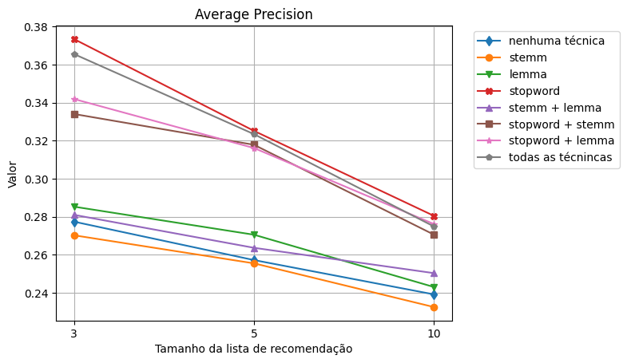
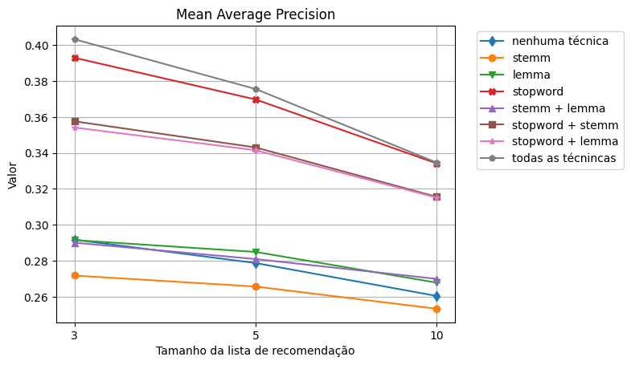

# mata66-tcc

## Setup.: Python 3.10

- Whindows (CMD on project root folder)

$python -m venv venv

$venv\Scripts\activate

$pip install -r requirements.txt

- Linux (terminal on project root folder)

$python3 -m venv venv

$source bin\activate

$pip3 install -r requirements.txt

## Some results preview

