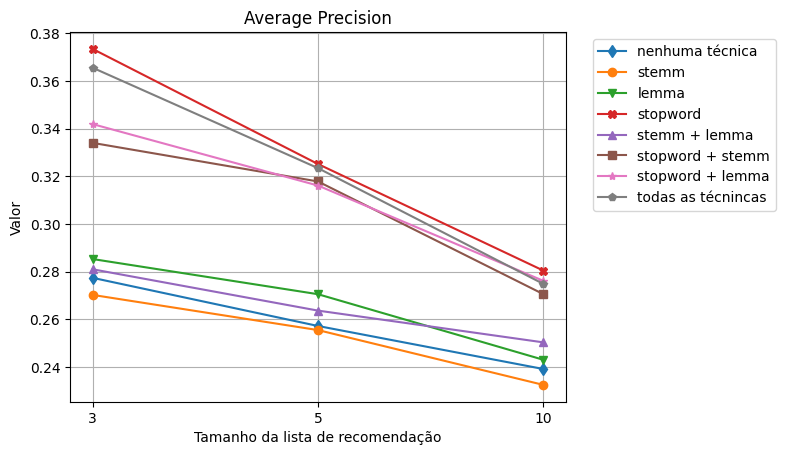
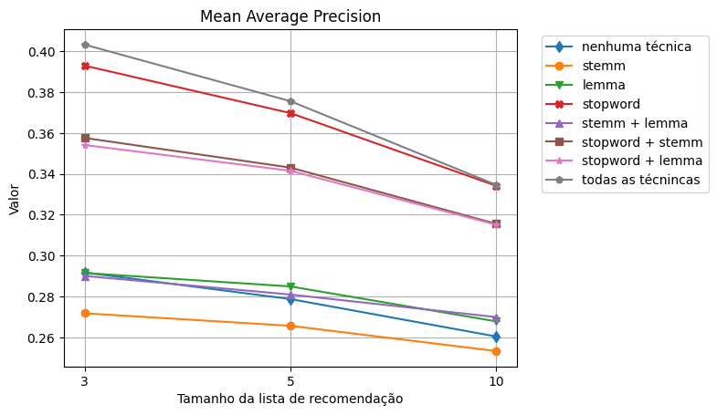
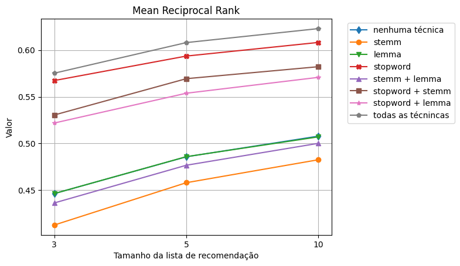

# Text Pre Processing Techniques

## Setup.: Python 3.10

- Whindows (CMD on project root folder)

$python -m venv venv

$venv\Scripts\activate

$pip install -r requirements.txt

- Linux (terminal on project root folder)

$python3 -m venv venv

$source bin\activate

$pip3 install -r requirements.txt

- Install pytorch

## Some results preview

 
 

## Run

- Fallow the steps to retrieve the dataset in each dataset folder, which you want to run
- Run : \
    main.ipynb
    
    or

    $main.py <i>dataset-name</i>

## Tests

<b>Run all tests</b> 
$python -m unittest discover

<b>Run only one test class</b> 
<i>$python -m unittest package.file.ClassName</i>  
<i>$python -m unittest package.file.ClassName.test_method</i>  
